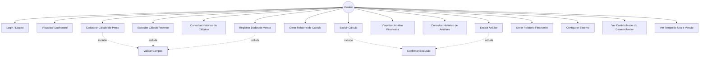
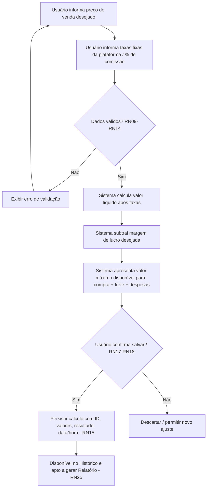
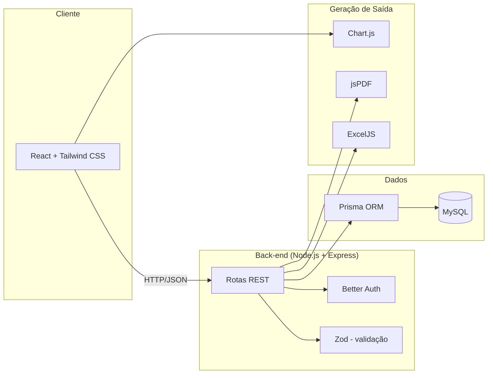

# Arquitetura

> Parte da documentação do Sistema de Gestão Comercial e Financeira.
> Veja também: [Visão Geral](./visao-geral.md), [Requisitos](./requisitos.md),
> [Regras de Negócio](./regras-de-negocio.md), [Modelo de Dados (MER)](./modelo-de-dados-mer.md),
> [Roadmap](./roadmap.md).

## 6.1 Diagrama de Casos de Uso

## 6.2 Fluxo do Cálculo Reverso (principal diferencial do sistema)

## 6.3 Arquitetura Técnica

| Camada | Tecnologia | Papel no sistema |
|---|---|---|
| Front-end | React + Tailwind CSS | Dashboard, formulários de cálculo, histórico, telas de configuração |
| Back-end | Node.js + Express | API REST que expõe as regras de negócio |
| Autenticação | Better Auth | Login, logout, sessão (RN01–RN06) |
| Validação | Zod | Validação de payloads no servidor (RN09–RN14, RNF03) |
| Persistência | Prisma + MySQL | Modelo de dados relacional (ver [MER](./modelo-de-dados-mer.md)) |
| Gráficos | Chart.js | Visualizações no dashboard e nas análises financeiras |
| Relatórios | jsPDF / ExcelJS | Exportação de relatórios (RF07, RF12, RNF08) |
| Qualidade | ESLint, Prettier, Vitest | Padronização e testes automatizados (RNF07) |
