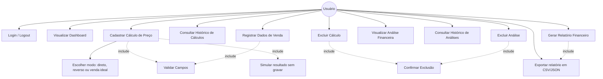

# Arquitetura

> Parte da documentação do Sistema de Gestão Comercial e Financeira.
> Veja também: [Visão Geral](./visao-geral.md), [Requisitos](./requisitos.md),
> [Regras de Negócio](./regras-de-negocio.md), [Modelo de Dados (MER)](./modelo-de-dados-mer.md),
> [API REST](./api.md), [Motor de Precificação](./motor-de-precificacao.md),
> [Rastreabilidade](./rastreabilidade.md).

## 6.1 Diagrama de Casos de Uso


```mermaid
flowchart TD
    U((Usuário))

    U --> UC1[Login / Logout]
    U --> UC2[Visualizar Dashboard]
    U --> UC3[Cadastrar Cálculo de Preço]
    UC3 --> UC3b[Escolher modo: direto, reverso ou venda ideal]
    U --> UC5[Consultar Histórico de Cálculos]
    U --> UC6[Excluir Cálculo]
    U --> UC8[Registrar Dados de Venda]
    U --> UC9[Visualizar Análise Financeira]
    U --> UC10[Consultar Histórico de Análises]
    U --> UC11[Excluir Análise]
    U --> UC12[Gerar Relatório Financeiro]
    U --> UC19[Exportar relatório em CSV/JSON]

    UC3 -.include.-> UC16[Validar Campos]
    UC3 -.include.-> UC18[Simular resultado sem gravar]
    UC8 -.include.-> UC16
    UC12 -.include.-> UC19
    UC6 -.include.-> UC17[Confirmar Exclusão]
    UC11 -.include.-> UC17
```

Todos os casos de uso acima correspondem a telas implementadas. As listagens usam
paginação no servidor, e o relatório é lido de `/api/vendas/resumo`. 

## 6.2 Fluxo do Cálculo de Preço (principal diferencial do sistema)

```mermaid
flowchart TD
    A[Usuário abre Novo cálculo] --> B[Escolhe o modo: direto, reverso ou vendaIdeal]
    B --> C[Informa custo, frete e percentuais]
    C --> D{Campos obrigatórios preenchidos? RN07}
    D -- Não --> E[Mostrar a fórmula e o que falta]
    E --> C
    D -- Sim --> F[Normalizar vírgula/ponto decimal - RN09]
    F --> G[POST /api/simulacoes/preco - debounce 250 ms]
    G --> H{Motor aceita? RN43-RN49}
    H -- Não --> I[Painel "Cálculo impossível" com a mensagem do backend]
    I --> C
    H -- Sim --> J[Mostrar total em destaque, lucro/margem e detalhamento]
    J --> K{Margem obtida abaixo da desejada?}
    K -- Sim --> L[Aviso para ajustar os percentuais]
    K -- Não --> M[Exibir a fórmula usada]
    L --> N{Usuário salva? RN15-RN16}
    M --> N
    N -- Não --> O[Descartar / continuar ajustando]
    N -- Sim --> P[POST /api/calculos - o servidor recalcula pela mesma fórmula]
    P --> Q[Persistir entradas e derivados - RN13]
    Q --> R[Disponível no histórico, nos cards agregados e nos relatórios]
```

### Por que a fórmula vive no back-end

O cálculo é executado pelo **motor** ([`backend/src/lib/precificacao.ts`](../backend/src/lib/precificacao.ts)),
e não no navegador:

- o front-end **simula** chamando `POST /api/simulacoes/preco`, com `debounce` de 250 ms;
- o front-end nunca envia campos derivados — a API os ignora;
- ao salvar, a API roda o **mesmo** motor, então o valor salvo é idêntico ao previso;
- o motor é puro e tem 13 testes unitários cobrindo os três modos e os erros de negócio.

Fórmulas em [Motor de Precificação](./motor-de-precificacao.md).

## 6.3 Arquitetura Técnica

```mermaid
flowchart LR
    subgraph Cliente["Front-end (React 18 + Vite)"]
        Pages[Telas: Login, Dashboard,<br/>Cálculos, Novo cálculo,<br/>Vendas, Análises, Relatórios]
        Client[lib/api.ts<br/>wrapper fetch + tipos]
    end

    subgraph API["Back-end (Node.js + Express)"]
        Auth[Better Auth<br/>/api/auth/*]
        Guard[requireAuth<br/>+ loginGuard]
        Val[Zod - validação]
        Motor[Motor de precificação<br/>(puro, com testes)]
        Routes[Rotas REST]
    end

    subgraph Dados
        Prisma[Prisma ORM]
        PostgreSQL[(PostgreSQL)]
    end

    subgraph Saida["Geração de Saída"]
        Charts[Recharts<br/>dashboard e relatórios]
        Export[Exportação CSV/JSON<br/>montada no servidor]
    end

    Pages --> Client
    Client -- "/api via proxy do Vite" --> Guard
    Guard --> Auth
    Guard --> Routes
    Routes --> Val
    Routes --> Motor
    Routes --> Prisma
    Prisma --> PostgreSQL
    Routes --> Export
    Pages --> Charts
```

| Camada | Tecnologia | Papel no sistema |
|---|---|---|
| Front-end | React 18 + Vite + Tailwind CSS 4 | Dashboard, formulários de cálculo, histórico e relatórios |
| Roteamento | React Router 6 | Rotas protegidas; `/calculos` lista e `/calculos/novo` cria |
| Back-end | Node.js + Express | API REST que expõe as regras de negócio |
| Autenticação | Better Auth | Login, logout e sessão por cookie (RN01–RN06) |
| Proteção de rotas | `requireAuth` + `loginGuard` | Bloqueio por tentativas (RN02) e isolamento por usuário (RN06, RN42) |
| Validação | Zod | Validação de payloads no servidor (RN07–RN12, RNF02) |
| Cálculo | Módulo puro `precificacao.ts` | Fonte única da verdade das fórmulas (RN43–RN49) |
| Persistência | Prisma + PostgreSQL | Modelo de dados relacional (ver [MER](./modelo-de-dados-mer.md)) |
| Paginação e agregação | `skip`/`take` + `aggregate`, `count`, `groupBy` | Listagens paginadas e cards somados no banco, não no navegador (RNF04, RNF05) |
| Gráficos | Recharts | Visualizações no dashboard e nos relatórios |
| Relatórios | Exportação CSV/JSON no servidor | Relatórios de performance (RF15, RF16, RNF07) |
| Qualidade | ESLint, Prettier, Vitest | Padronização e testes automatizados (RNF06) |

## 6.4 Organização das telas

| Rota | Componente | Responsabilidade |
|---|---|---|
| `/login` | `pages/Login.tsx` | Login por e-mail e senha; trata o `429` de tentativas excedidas |
| `/` | `pages/Dashboard.tsx` | KPIs e evolução mensal agregados no banco; últimos 5 registros |
| `/calculos` | `pages/Calculos.tsx` | Histórico paginado, cards agregados e exclusão |
| `/calculos/novo` | `pages/NovoCalculo.tsx` | Formulário de cálculo com prévia em tempo real |
| `/vendas` | `pages/Vendas.tsx` | Registro de vendas com lucro previsto e histórico paginado |
| `/analises` | `pages/Analises.tsx` | Análises financeiras por período, com histórico paginado |
| `/relatorios` | `pages/Relatorios.tsx` | Performance por período, gráficos e exportação CSV/JSON |

Detalhe de cada arquivo em [`frontend/README.md`](../frontend/README.md).

## 6.5 Camadas do back-end

```
Requisição HTTP
  └─ loginGuard (só em /api/auth/sign-in)      bloqueio por tentativas (RN02)
      └─ requireAuth (routers de negócio)       sessão válida (RN03, RN06)
          └─ Zod (safeParse)                   validação de entrada (RN07–RN12)
              └─ calcularPrecificacao          motor puro (RN43–RN49)
                  └─ Prisma → PostgreSQL       persistência
```

Detalhe de cada rota, com payloads e formatos de erro, em [API REST](./api.md).
