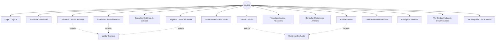
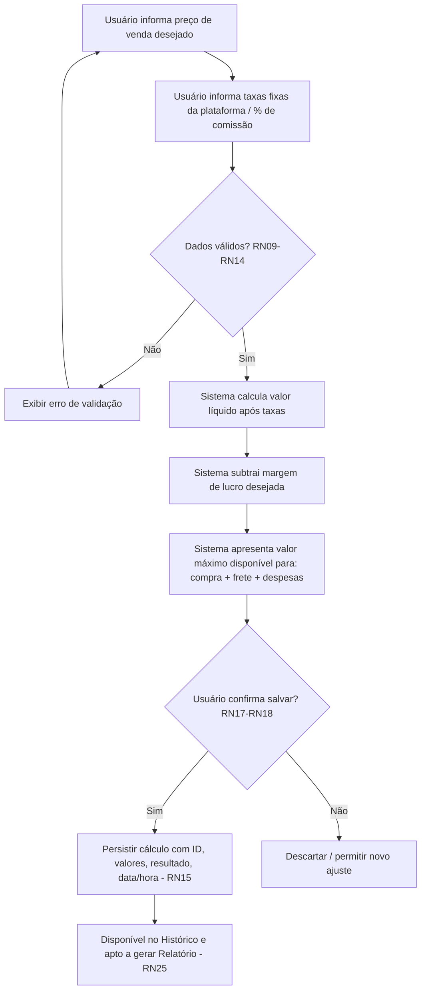
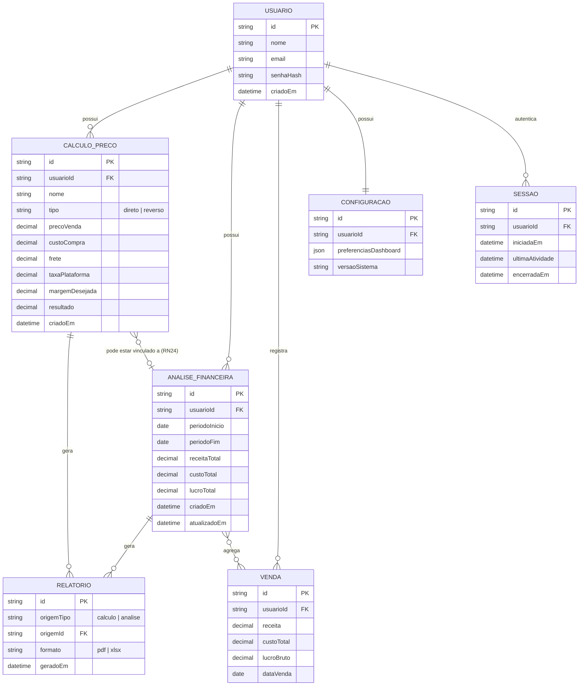
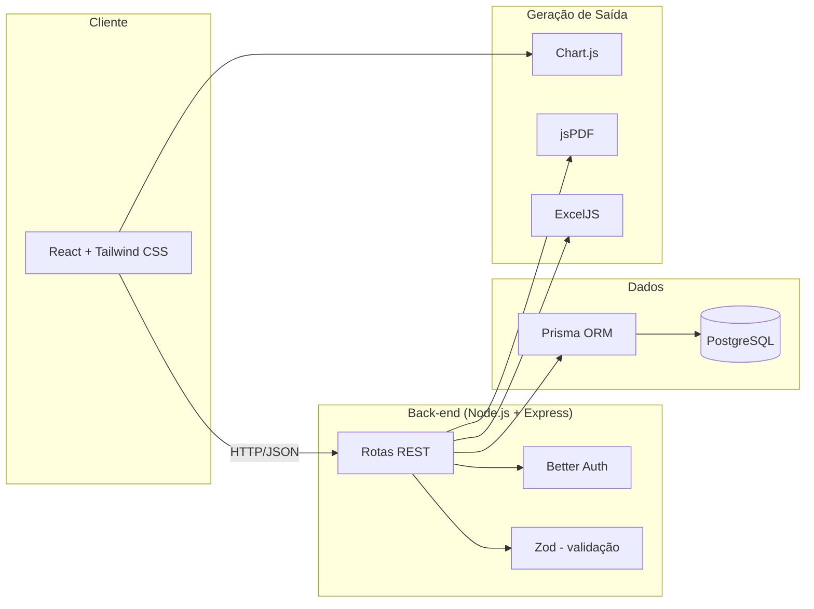

# Especificação de Requisitos e Modelagem do Sistema
## Sistema de Gestão Comercial e Financeira com Cálculo de Preço de Venda

**Repositório:** [github.com/arianearchanjo/loja-automotiva](https://github.com/arianearchanjo/loja-automotiva/tree/main)
**Versão do documento:** 1.0
**Status:** Em elaboração — base para discussão da equipe

---

## 1. Visão Geral

O sistema é uma ferramenta acadêmica de **gestão comercial e financeira** voltada a um usuário que hoje controla seu negócio por meio de múltiplas planilhas Excel. O objetivo central é substituir esse controle manual por uma aplicação web capaz de:

- Calcular o **preço de venda** de produtos a partir de custos, frete e taxas;
- Executar o **cálculo reverso**: a partir do preço de venda desejado, determinar quanto pode ser gasto com compra, frete, taxas de plataforma e demais despesas;
- Comparar **custo × venda** e acompanhar receitas, custos e lucro;
- Manter **histórico** de cálculos e análises, com possibilidade de exclusão e geração de relatórios;
- Oferecer um **dashboard** interativo e personalizável como painel central de uso.

O sistema é de **usuário único** (single-tenant por conta), que desempenha todos os papéis do processo comercial — do planejamento de compra ao pós-venda.

### 1.1 Objetivo do documento

Consolidar, organizar e complementar o levantamento inicial de requisitos (regras de negócio e requisitos funcionais) e apresentar uma modelagem inicial do sistema (casos de uso, modelo de dados e arquitetura) que sirva de base para o desenvolvimento incremental do projeto.

### 1.2 Fora de escopo (versão inicial)

Conforme definido pela equipe, o desenvolvimento seguirá uma abordagem incremental. Ficam fora do MVP (podendo compor versões futuras):

- Múltiplos usuários/perfis (multiusuário, permissões, times);
- Integrações diretas com marketplaces/e-commerces (importação automática de taxas e vendas);
- Notificações automáticas (e-mail/push);
- Relatórios comparativos entre períodos e projeções financeiras avançadas;
- Aplicativo mobile nativo.

---

## 2. Stakeholders e Atores

| Ator | Descrição |
|---|---|
| **Usuário (Vendedor/Gestor)** | Ator único do sistema. Realiza login, cadastra cálculos e análises, consulta histórico, gera relatórios e configura o sistema. |
| **Sistema** | Executa validações, cálculos automáticos e geração de relatórios. |
| **Equipe de desenvolvimento** | Mantém o sistema, disponibiliza notas/contato via tela de configurações. |

---

## 3. Requisitos Funcionais (RF)

Requisitos reorganizados por módulo, com prioridade sugerida (MoSCoW) para orientar o desenvolvimento incremental.

### 3.1 Módulo — Acesso e Dashboard

| ID | Requisito | Prioridade |
|---|---|---|
| RF01 | O sistema deve permitir que o usuário faça **login** e **logout**. | Must |
| RF02 | O sistema deve exibir um **dashboard** dinâmico, interativo e personalizável, como tela inicial pós-login. | Must |

### 3.2 Módulo — Gestão de Vendas (Cálculo de Preço)

| ID | Requisito | Prioridade |
|---|---|---|
| RF03 | O usuário deve poder **cadastrar cálculos** de preço, que ficam salvos no sistema. | Must |
| RF04 | O usuário deve poder **inserir valores** (custo, frete, taxas, margem desejada etc.) e obter o **resultado calculado**. | Must |
| RF04.1 | O sistema deve oferecer o modo de **cálculo reverso**: a partir do preço de venda informado, calcular o valor máximo disponível para compra, frete, taxas e demais despesas. | Must |
| RF05 | O usuário deve poder **consultar o histórico** de cálculos realizados. | Must |
| RF06 | O usuário deve poder **excluir** um cálculo do histórico. | Must |
| RF07 | O usuário deve poder **gerar um relatório** (arquivo) com os resultados de um cálculo. | Should |

### 3.3 Módulo — Gestão Financeira

| ID | Requisito | Prioridade |
|---|---|---|
| RF08 | O usuário deve poder **registrar dados de vendas** (ex.: receita, lucro bruto, custos). | Should |
| RF09 | O usuário deve poder **visualizar análises** dos dados financeiros inseridos (receitas, custos, lucros). | Should |
| RF10 | O usuário deve poder **consultar o histórico** de análises financeiras. | Should |
| RF11 | O usuário deve poder **excluir** uma análise financeira. | Should |
| RF12 | O usuário deve poder **gerar um relatório** com os resultados de uma análise financeira. | Could |

### 3.4 Módulo — Configurações e Informações Gerais

| ID | Requisito | Prioridade |
|---|---|---|
| RF13 | O usuário deve poder acessar **configurações** básicas do sistema. | Should |
| RF14 | O usuário deve poder visualizar **contato/notas dos desenvolvedores**. | Could |
| RF15 | O sistema deve exibir o **tempo de uso** do usuário. | Could |
| RF16 | O sistema deve exibir a **versão** atual do sistema. | Could |

---

## 4. Requisitos Não Funcionais (RNF)

O levantamento original concentrava-se em regras de negócio; os itens abaixo foram **adicionados** para cobrir qualidade técnica, alinhados à stack definida pela equipe.

| ID | Categoria | Requisito |
|---|---|---|
| RNF01 | Segurança | Senhas devem ser armazenadas com hash (via Better Auth); sessões devem expirar por inatividade (RN05). |
| RNF02 | Segurança | Toda comunicação entre front-end e API deve ocorrer via HTTPS em produção. |
| RNF03 | Validação | Toda entrada de dados no back-end deve ser validada com Zod antes de persistência (defesa em profundidade, além da validação de front-end). |
| RNF04 | Usabilidade | O dashboard deve ser responsivo (desktop e mobile), usando Tailwind CSS. |
| RNF05 | Desempenho | Cálculos (diretos e reversos) devem retornar resultado em até 1s em condições normais de uso. |
| RNF06 | Confiabilidade | Falhas de conexão ou do sistema não devem corromper ou apagar dados já persistidos (RN57, RN64). |
| RNF07 | Manutenibilidade | O código deve seguir padronização via ESLint + Prettier e ter cobertura de testes automatizados (Vitest) para as regras de cálculo. |
| RNF08 | Portabilidade de dados | Relatórios devem poder ser exportados em PDF (jsPDF) e Excel/CSV (ExcelJS). |
| RNF09 | Auditabilidade | Operações relevantes (criação, exclusão) devem registrar usuário, data e hora (RN62). |

---

## 5. Regras de Negócio (RN)

Regras de negócio organizadas por módulo, preservando a numeração original do levantamento.

### 5.1 Menu inicial e acesso

| ID | Regra |
|---|---|
| RN01 | O acesso ao sistema exige login e senha válidos. |
| RN02 | Após três tentativas inválidas, o login é bloqueado temporariamente. |
| RN03 | Somente usuários autenticados acessam as funções do sistema. |
| RN04 | O logout encerra a sessão e retorna à tela de login. |
| RN05 | A sessão é encerrada após um período sem atividade. |
| RN06 | Cada usuário visualiza somente os próprios dados. |
| RN07 | Personalizações válidas do dashboard são salvas. |
| RN08 | Elementos essenciais do dashboard não podem ser removidos. |

### 5.2 Gestão de vendas e cálculos

| ID | Regra |
|---|---|
| RN09 | Todos os campos obrigatórios devem ser preenchidos. |
| RN10 | Campos numéricos aceitam somente números válidos. |
| RN11 | O sistema aceita e padroniza vírgula ou ponto decimal. |
| RN12 | Operações inválidas, como divisão por zero, são impedidas. |
| RN13 | Valores negativos são aceitos somente quando permitidos pelo contexto. |
| RN14 | Os valores são validados antes do cálculo. |
| RN15 | Cada cálculo possui identificação, valores, resultado, data e hora. |
| RN16 | O nome do cálculo respeita um limite de caracteres. |
| RN17 | O sistema informa o sucesso ou a falha do salvamento. |
| RN18 | O sistema impede salvamento duplicado por cliques repetidos. |
| RN19 | O histórico mostra somente os cálculos do usuário autenticado. |
| RN20 | O sistema informa quando o histórico está vazio. |
| RN21 | A exclusão exige confirmação e é permanente. |
| RN22 | Cancelar ou fechar a confirmação não exclui o cálculo. |
| RN23 | Após a exclusão, o histórico é atualizado. |
| RN24 | Cálculos vinculados a análises não podem ser excluídos. |
| RN25 | Somente cálculos válidos podem gerar relatórios. |
| RN26 | O relatório mostra valores, resultado, usuário, data e hora. |
| RN27 | Falhas no relatório não alteram o cálculo original. |

### 5.3 Gestão financeira

| ID | Regra |
|---|---|
| RN28 | Os dados financeiros obrigatórios devem ser preenchidos. |
| RN29 | Valores financeiros são exibidos no formato monetário. |
| RN30 | A data final não pode ser anterior à data inicial. |
| RN31 | Toda análise deve indicar o período considerado. |
| RN32 | Resultados possíveis são calculados automaticamente. |
| RN33 | O sistema diferencia dados informados de dados calculados. |
| RN34 | Somente análises válidas podem ser salvas. |
| RN35 | Cada análise possui identificação, período, data e resultados. |
| RN36 | Alterações nos dados exigem o recálculo da análise. |
| RN37 | Cada usuário visualiza somente suas próprias análises. |
| RN38 | Valores monetários são exibidos com duas casas decimais. |
| RN39 | A exclusão de uma análise exige confirmação. |
| RN40 | Excluir uma análise não exclui os dados de vendas associados. |
| RN41 | O relatório financeiro exibe dados, período e resultados. |
| RN42 | Análises incompletas não podem gerar relatórios. |
| RN43 | O relatório informa que os resultados dependem dos dados inseridos. |

### 5.4 Configurações e informações gerais

| ID | Regra |
|---|---|
| RN44 | O usuário altera somente configurações permitidas. |
| RN45 | Alterações importantes exigem confirmação. |
| RN46 | O usuário pode restaurar as configurações originais. |
| RN47 | Configurações inválidas são substituídas pelas configurações padrão. |
| RN48 | As notas do desenvolvedor são apenas para consulta. |
| RN49 | Somente contatos autorizados do desenvolvedor são exibidos. |
| RN50 | O tempo de uso é contado entre login e logout. |
| RN51 | O sistema diferencia o tempo atual do tempo total de uso. |
| RN52 | Períodos prolongados sem atividade não são contabilizados no tempo de uso. |
| RN53 | A versão do sistema não pode ser alterada pelo usuário. |
| RN54 | A versão segue um padrão de numeração semântica (ex.: 1.0.0). |

### 5.5 Regras gerais de proteção

| ID | Regra |
|---|---|
| RN55 | Botões de exclusão têm destaque visual. |
| RN56 | Nenhum registro é excluído sem confirmação. |
| RN57 | Falhas no sistema não devem apagar dados já salvos. |
| RN58 | O sistema avisa sobre alterações não salvas antes da saída. |
| RN59 | Envios repetidos do mesmo formulário são impedidos. |
| RN60 | Campos obrigatórios e seus erros são identificados visualmente. |
| RN61 | Mensagens de erro não exibem informações internas do sistema. |
| RN62 | Operações importantes são registradas com usuário e data. |
| RN63 | Um registro é considerado salvo somente após a confirmação. |
| RN64 | Falhas de conexão não apagam dados já armazenados. |
| RN65 | Um usuário não pode acessar registros de outra conta. |

---

## 6. Modelagem do Sistema

### 6.1 Diagrama de Casos de Uso

### 6.2 Fluxo do Cálculo Reverso (principal diferencial do sistema)

### 6.3 Modelo Conceitual de Dados

**Notas sobre o modelo:**
- `CALCULO_PRECO.tipo` distingue o **cálculo direto** (custo → preço) do **cálculo reverso** (preço → custo máximo), evitando duplicar entidades.
- O vínculo opcional entre `CALCULO_PRECO` e `ANALISE_FINANCEIRA` implementa a RN24 (cálculo vinculado a análise não pode ser excluído).
- `RELATORIO` é modelado como entidade própria (e não apenas um export "on the fly") para permitir histórico/rastreabilidade de gerações, alinhado à RN26/RN41.
- `SESSAO` suporta RN02 (bloqueio após tentativas inválidas — controlado por contagem/tempo), RN05 (expiração por inatividade) e RN50–RN52 (tempo de uso).

### 6.4 Arquitetura Técnica (baseada na stack definida)

| Camada | Tecnologia | Papel no sistema |
|---|---|---|
| Front-end | React + Tailwind CSS | Dashboard, formulários de cálculo, histórico, telas de configuração |
| Back-end | Node.js + Express | API REST que expõe as regras de negócio |
| Autenticação | Better Auth | Login, logout, sessão (RN01–RN06) |
| Validação | Zod | Validação de payloads no servidor (RN09–RN14, RNF03) |
| Persistência | Prisma + PostgreSQL | Modelo de dados relacional (seção 6.3) |
| Gráficos | Chart.js | Visualizações no dashboard e nas análises financeiras |
| Relatórios | jsPDF / ExcelJS | Exportação de relatórios (RF07, RF12, RNF08) |
| Qualidade | ESLint, Prettier, Vitest | Padronização e testes automatizados (RNF07) |

---

## 7. Rastreabilidade — Requisitos × Regras de Negócio

| Requisito Funcional | Regras de negócio relacionadas |
|---|---|
| RF01 (Login/Logout) | RN01–RN06 |
| RF02 (Dashboard) | RN07, RN08 |
| RF03–RF04 (Cadastrar/Calcular) | RN09–RN18 |
| RF04.1 (Cálculo reverso) | RN09–RN14 |
| RF05 (Histórico de cálculos) | RN19, RN20 |
| RF06 (Excluir cálculo) | RN21–RN24, RN55–RN57 |
| RF07 (Relatório de cálculo) | RN25–RN27 |
| RF08–RF09 (Vendas/Análise) | RN28–RN33 |
| RF10 (Histórico de análises) | RN34, RN37 |
| RF11 (Excluir análise) | RN39, RN40 |
| RF12 (Relatório financeiro) | RN41–RN43 |
| RF13 (Configurações) | RN44–RN47 |
| RF14 (Contato/notas) | RN48, RN49 |
| RF15–RF16 (Tempo de uso/versão) | RN50–RN54 |
| Transversal (todos) | RN58–RN65 |

---

## 8. Roadmap Sugerido

| Fase | Escopo |
|---|---|
| **MVP** | RF01, RF02, RF03, RF04, RF04.1, RF05, RF06 — núcleo de autenticação e cálculo (direto + reverso), com validações essenciais (RN01–RN27). |
| **v1.1** | RF07 (relatórios de cálculo), RF13 (configurações básicas). |
| **v1.2** | RF08, RF09, RF10, RF11 — módulo financeiro. |
| **v1.3** | RF12 (relatórios financeiros), RF14, RF15, RF16. |
| **Futuro** | Multiusuário, integrações com marketplaces, notificações, projeções e comparativos avançados. |

---

## 9. Pontos em Aberto para a Equipe

1. Definir as fórmulas exatas do cálculo direto e do cálculo reverso (depende das planilhas do usuário-alvo, ainda a serem coletadas).
2. Definir o conjunto de campos obrigatórios de "dados de venda" (RF08) — ex.: quais categorias de custo compõem o custo total.
3. Definir regra de bloqueio de login (RN02): tempo de bloqueio e se há reset por e-mail.
4. Confirmar se `RELATORIO` deve ser persistido (histórico de exportações) ou gerado sob demanda sem registro em banco.
5. Detalhar as "personalizações válidas do dashboard" (RN07) — quais widgets são configuráveis.
