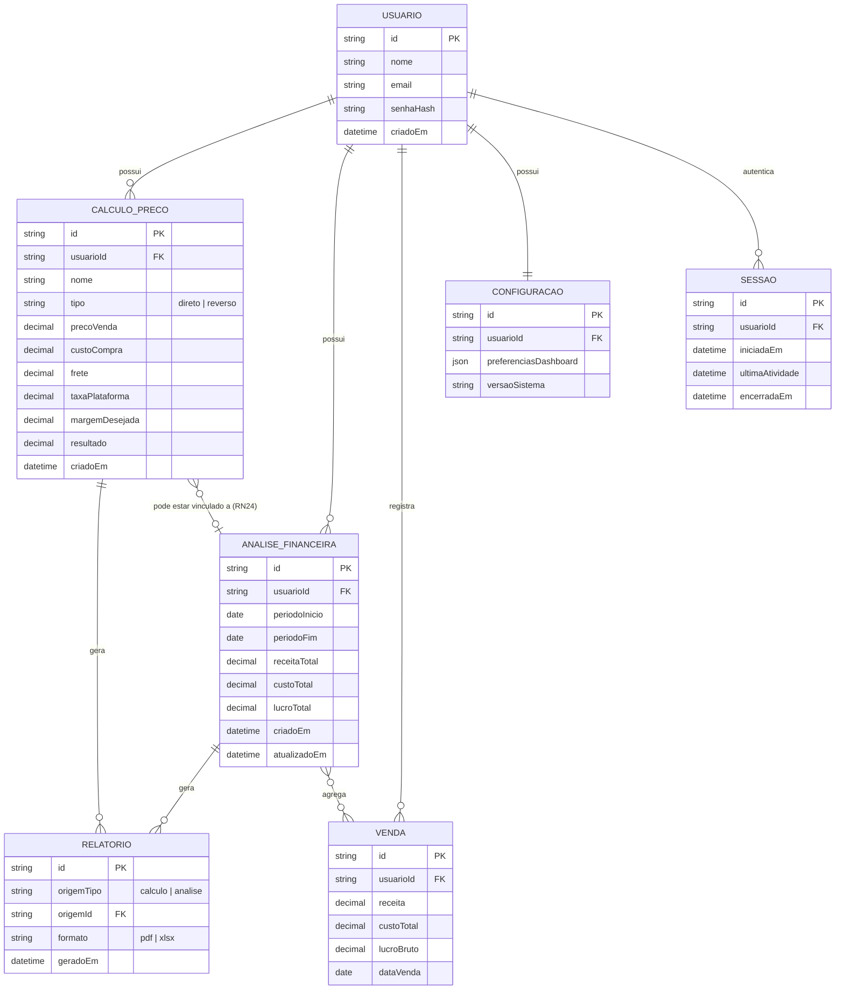

# Modelo de Dados (MER)

> Parte da documentação do Sistema de Gestão Comercial e Financeira.
> Veja também: [Visão Geral](./visao-geral.md), [Requisitos](./requisitos.md),
> [Regras de Negócio](./regras-de-negocio.md), [Arquitetura](./arquitetura.md),
> [Roadmap](./roadmap.md).

Modelo Entidade-Relacionamento (MER) do sistema, derivado da especificação (seção 6.3).
A implementação física em Prisma/MySQL está em
[`backend/prisma/schema.prisma`](../backend/prisma/schema.prisma).

## MER (Diagrama Entidade-Relacionamento)

## Entidades e atributos (resumo)

| Entidade | Principais atributos | Observações |
|---|---|---|
| **USUARIO** | id, nome, email, senhaHash, criadoEm | Gerenciada pelo Better Auth (tabela `usuario`). |
| **SESSAO** | id, usuarioId, iniciadaEm, ultimaAtividade, encerradaEm | Suporta RN02, RN05, RN50–RN52. |
| **CALCULO_PRECO** | id, usuarioId, nome, tipo, precoVenda, custoCompra, frete, taxaPlataforma, margemDesejada, resultado, criadoEm | `tipo` distingue direto/reverso (RN15). |
| **VENDA** | id, usuarioId, receita, custoTotal, lucroBruto, dataVenda | Dados financeiros (RF08). |
| **ANALISE_FINANCEIRA** | id, usuarioId, periodoInicio, periodoFim, receitaTotal, custoTotal, lucroTotal, criadoEm, atualizadoEm | Agrega vendas e cálculos (RN31, RN36). |
| **RELATORIO** | id, origemTipo, origemId, formato, geradoEm | Histórico de exportações (RN26, RN41). |
| **CONFIGURACAO** | id, usuarioId, preferenciasDashboard, versaoSistema | Preferências do dashboard (RN07). |

## Mapeamento para o Prisma

- O `CALCULO_PRECO.tipo` é implementado como `enum TipoCalculo { direto, reverso }`.
- `RELATORIO.origemTipo` e `formato` são `enum`s (`OrigemRelatorio`, `FormatoRelatorio`).
- Valores monetários usam `Decimal(12, 4)` no MySQL.
- `RELATORIO` é **polimórfico** (origem pode ser cálculo ou análise); por isso não há
  relação Prisma direta — o vínculo é feito por `origemTipo` + `origemId`.
- O vínculo opcional `CALCULO_PRECO → ANALISE_FINANCEIRA` implementa a RN24 (cálculo
  vinculado a análise não pode ser excluído → `onDelete: SetNull`).
