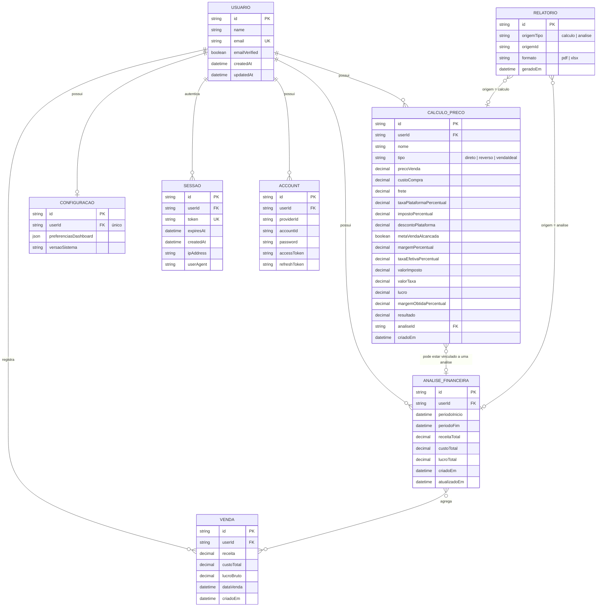

# Modelo de Dados (MER)

> Parte da documentação do Sistema de Gestão Comercial e Financeira.
> Veja também: [Visão Geral](./visao-geral.md), [Requisitos](./requisitos.md),
> [Regras de Negócio](./regras-de-negocio.md), [Arquitetura](./arquitetura.md),
> [Rastreabilidade](./rastreabilidade.md).

Modelo Entidade-Relacionamento (MER) do sistema e seu mapeamento físico. A implementação
em Prisma/PostgreSQL está em
[`backend/prisma/schema.prisma`](../backend/prisma/schema.prisma).

## MER (Diagrama Entidade-Relacionamento)

```mermaid
erDiagram
    USUARIO ||--o{ CALCULO_PRECO : possui
    USUARIO ||--o{ ANALISE_FINANCEIRA : possui
    USUARIO ||--o{ VENDA : registra
    USUARIO ||--o| CONFIGURACAO : possui
    USUARIO ||--o{ SESSAO : autentica
    USUARIO ||--o{ ACCOUNT : possui
    ANALISE_FINANCEIRA }o--o{ VENDA : agrega
    CALCULO_PRECO }o--o| ANALISE_FINANCEIRA : "pode estar vinculado a uma analise"
    RELATORIO }o--o| CALCULO_PRECO : "origem = calculo"
    RELATORIO }o--o| ANALISE_FINANCEIRA : "origem = analise"

    USUARIO {
        string id PK
        string name
        string email UK
        boolean emailVerified
        datetime createdAt
        datetime updatedAt
    }

    SESSAO {
        string id PK
        string userId FK
        string token UK
        datetime expiresAt
        datetime createdAt
        string ipAddress
        string userAgent
    }

    ACCOUNT {
        string id PK
        string userId FK
        string providerId
        string accountId
        string password
        string accessToken
        string refreshToken
    }

    CALCULO_PRECO {
        string id PK
        string userId FK
        string nome
        string tipo "direto | reverso | vendaIdeal"
        decimal precoVenda
        decimal custoCompra
        decimal frete
        decimal taxaPlataformaPercentual
        decimal impostoPercentual
        decimal descontoPlataforma
        boolean metaVendaAlcancada
        decimal margemPercentual
        decimal taxaEfetivaPercentual
        decimal valorImposto
        decimal valorTaxa
        decimal lucro
        decimal margemObtidaPercentual
        decimal resultado
        string analiseId FK
        datetime criadoEm
    }

    VENDA {
        string id PK
        string userId FK
        decimal receita
        decimal custoTotal
        decimal lucroBruto
        datetime dataVenda
        datetime criadoEm
    }

    ANALISE_FINANCEIRA {
        string id PK
        string userId FK
        datetime periodoInicio
        datetime periodoFim
        decimal receitaTotal
        decimal custoTotal
        decimal lucroTotal
        datetime criadoEm
        datetime atualizadoEm
    }

    RELATORIO {
        string id PK
        string origemTipo "calculo | analise"
        string origemId
        string formato "pdf | xlsx"
        datetime geradoEm
    }

    CONFIGURACAO {
        string id PK
        string userId FK "único"
        json preferenciasDashboard
        string versaoSistema
    }
```

## Entidades e atributos

| Entidade (tabela) | Papel | Observações |
|---|---|---|
| **USUARIO** (`usuario`) | Conta de acesso | Gerida pelo Better Auth. Não há `senhaHash` aqui: o hash vive em `account.password`, tratado pelo adaptador Prisma. |
| **SESSION** (`session`) | Sessão de login | Suporta RN05 (expiração) e RN01–RN04. |
| **ACCOUNT** (`account`) | Credenciais e provedores | Better Auth com e-mail/senha habilitado. |
| **CALCULO_PRECO** (`calculo_preco`) | Resultado de um cálculo de preço | `tipo` distingue os três modos (RN13). Campos calculados são sempre preenchidos pelo motor. |
| **VENDA** (`venda`) | Registro financeiro | `lucroBruto` é calculado no servidor (RN26). |
| **ANALISE_FINANCEIRA** (`analise_financeira`) | Snapshot agregado de um período | Agrega vendas por período (RN24, RN25). |
| **RELATORIO** (`relatorio`) | Histórico de exportações | **Somente no schema**: ainda sem API nem UI. |
| **CONFIGURACAO** (`configuracao`) | Preferências do dashboard | **Somente no schema**: ainda sem API nem UI. |
| **VERIFICATION** | Tokens de verificação | Usada pelo Better Auth; sem verificação por e-mail ativa. |

## Decisões de modelagem

- **Percentuais, não valores em reais.** A migração `20261005195000_calc_preco_percentuais`
  trocou `taxaPlataforma` e `margemDesejada` (valores em R$) por
  `taxaPlataformaPercentual` e `margemPercentual`. Motivo: todos os percentuais incidem
  sobre o preço de venda (RN43), então percentage é o dado primário e o valor em reais é
  derivado.
- **Campos de entrada × campos calculados.** `CALCULO_PRECO` separa o que o usuário
  informa (`precoVenda`, `custoCompra`, `frete`, `taxaPlataformaPercentual`,
  `impostoPercentual`, `descontoPlataforma`, `metaVendaAlcancada`, `margemPercentual`) do
  que o motor calcula (`taxaEfetivaPercentual`, `valorImposto`, `valorTaxa`, `lucro`,
  `margemObtidaPercentual`, `resultado`). Isso garante RN26 e impede que o cliente envie
  números derivados (RN42).
- **`resultado` muda de significado por modo**: é o lucro no modo `direto`, o custo máximo
  no `reverso` e o preço de venda no `vendaIdeal`.
- **Desconto só é gravado com a meta atingida.** `POST /api/calculos` persiste
  `descontoPlataforma` apenas quando `metaVendaAlcancada` é verdadeiro (RN47).
- **`TipoCalculo`** é um `enum` do PostgreSQL com `direto`, `reverso` e `vendaIdeal`.
- **`Relatorio` é polimórfico**: a origem é `(origemTipo, origemId)`, sem chave estrangeira
  direta para `calculo_preco` nem `analise_financeira`.
- **`Configuracao` é 1:1 com `Usuario`** (`userId` único).
- **Vínculo opcional `CALCULO_PRECO → ANALISE_FINANCEIRA`** com `onDelete: SetNull`: um
  cálculo pode ser referenciado por uma análise, e excluir a análise desliga o vínculo em
  vez de apagar o cálculo.
- **Exclusão em cascata**: remover um usuário remove também sessões, contas, cálculos,
  vendas e análises. Vendas e análises também se ligam por tabela de junção
  (`_AnaliseFinanceiraToVenda`) para a agregação por período.

## Mapeamento para o Prisma

| Conceito | Implementação |
|---|---|
| Valores monetários | `Decimal(12, 4)` |
| Percentuais | `Decimal(5, 2)` |
| Moeda no JSON | O PostgreSQL devolve `Decimal` como **string**; o cliente converte antes de formatar |
| Nomes de tabela | Snake case via `@@map` (`calculo_preco`, `analise_financeira`, …) |
| Modelo do usuário | `Usuario` com `modelName: "usuario"` na config do Better Auth |
| Enums | `TipoCalculo`, `OrigemRelatorio`, `FormatoRelatorio` |

## Migrações

| Migração | Conteúdo |
|---|---|
| `20260915221556_init` | Tabelas, enums, índices, chaves estrangeiras e a tabela de junção análise ↔ venda |
| `20261005012726_desconto_taxa` | Campos `descontoPercentual`, `metaVendas` e `vendasAcumuladas` (depois removidos) |
| `20261005195000_calc_preco_percentuais` | Migração para percentuais: novo tipo `vendaIdeal`, campos de entrada e calculados, e remoção dos campos em R$ |

> ⚠️ O `.gitignore` da raiz ignora `prisma/migrations/*.sql`. As migrações já existentes
> **estão versionadas**; a regra só afeta arquivos novos.
